<div align="center">

# draft2craift

**Local-first AI writing studio for sourced, auditable drafting.**

***D**ocument **R**etrieval **A**ugmented **F**ile **T**ool **2** **C**ollaboratively **R**evised **AI** **F**ormatted **T**ext*

[](LICENSE)
[](https://python.org)
[]()
[]()
[]()

<!-- Add screenshot or demo GIF here -->
<!--  -->

</div>

---

draft2craift is a **PySide6 desktop app** that combines **Markdown writing**,
**local GGUF chat**, **document retrieval (RAG)**, and **fact-checking** in one
offline workflow.

## Why draft2craift

- **One workflow, one app:** draft, retrieve sources, chat, rewrite, and fact-check in place.
- **Local by default:** no cloud dependency, no account required, no API key required for local models.
- **Built for quality loops:** feedback can be converted into structured testcases and automated eval runs.

## Feature Overview

### 1) Writing workspace

- Three-pane layout: Knowledge Dock | Draft | AI Chat Dock
- Multi-tab Markdown editor
- Renameable tabs with compact inactive-tab mode
- Split Markdown + HTML preview with cursor sync
- Undo/Redo in draft header
- Optional direct rewrite into selected draft text
- Export active draft tab to PDF or DOCX
- Project autosave/restore flow

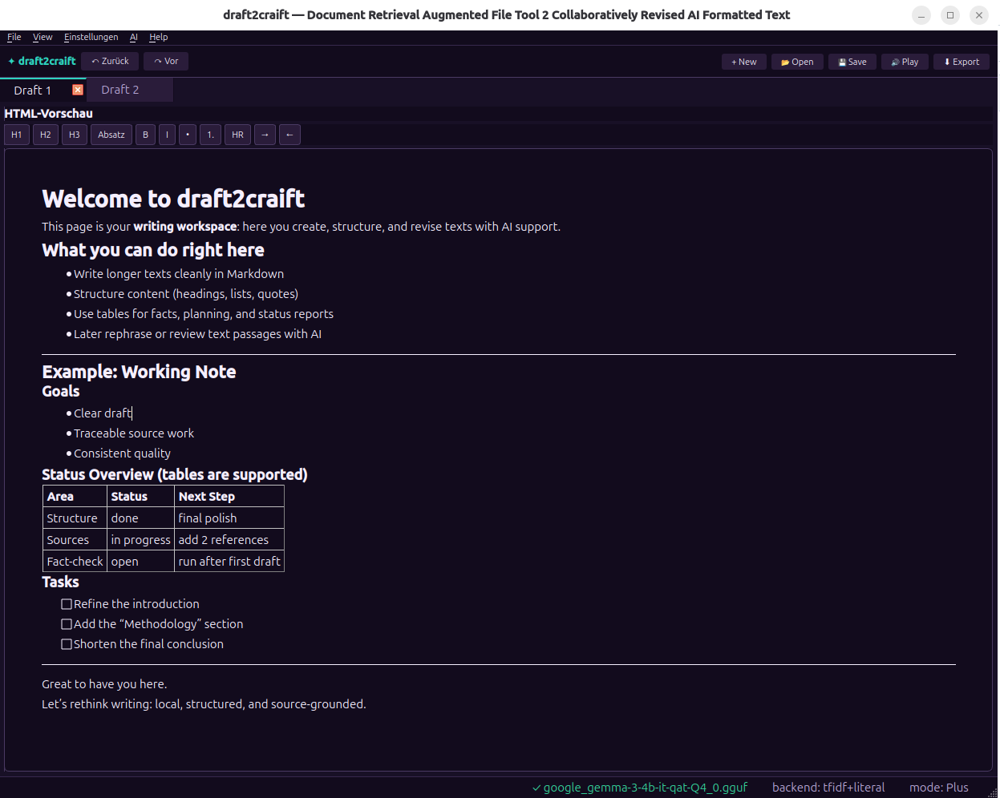
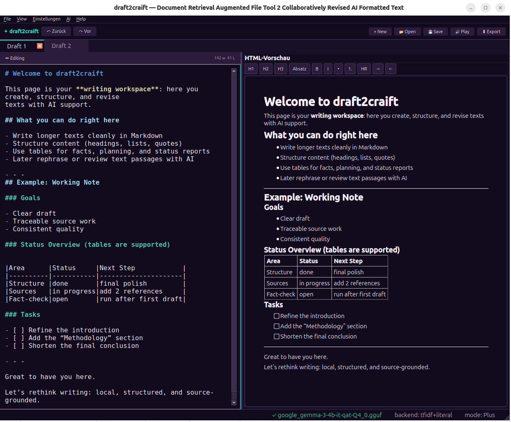

### 2) Knowledge import and PDF control

- Import: PDF, DOCX, HTML/HTM, ODT, CSV, TXT/RST/MD, code files
- Parallel multi-file import
- Knowledge viewer tabs can be renamed and deleted with confirmation
- PDF controls include:
  - page ranges (`all`, `1-5,8,10-`)
  - table strategies (`lines_strict`, `lines`, `text`, `none`)
  - heading detection (`pymupdf4llm`, `custom`, `none`)
  - paragraph reflow (`none`, `join`, `smart`)
  - auto/manual header-footer removal
- Import dialog PDF viewer with zoom, page navigation, overlays, draggable manual zones

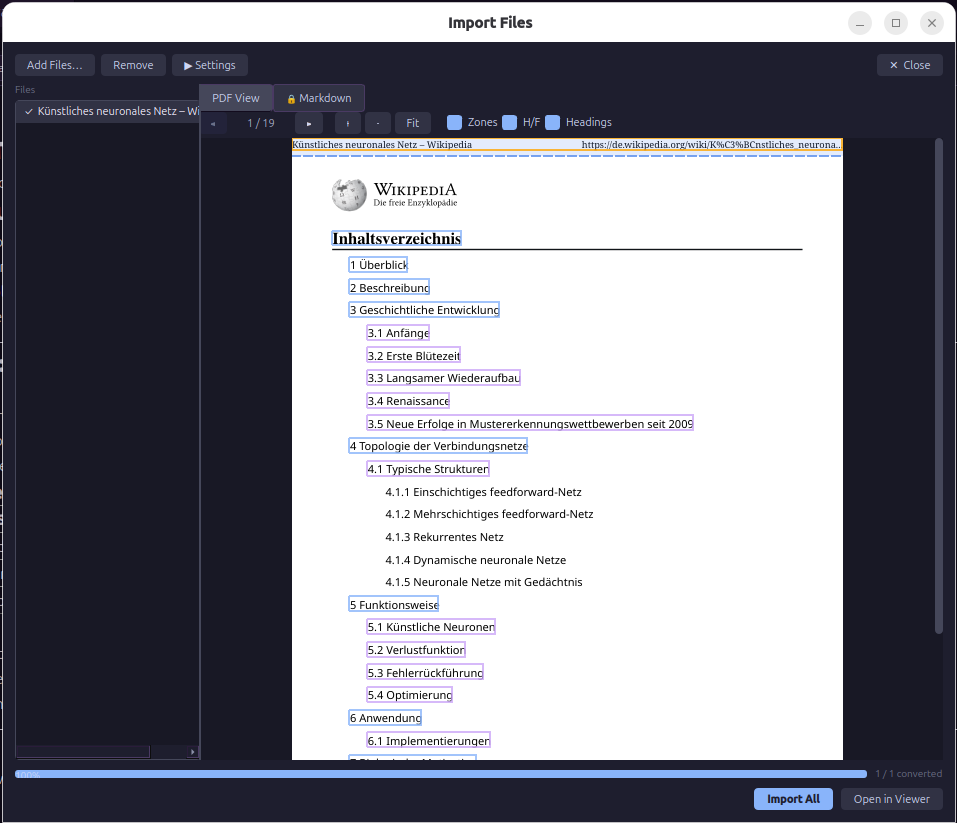
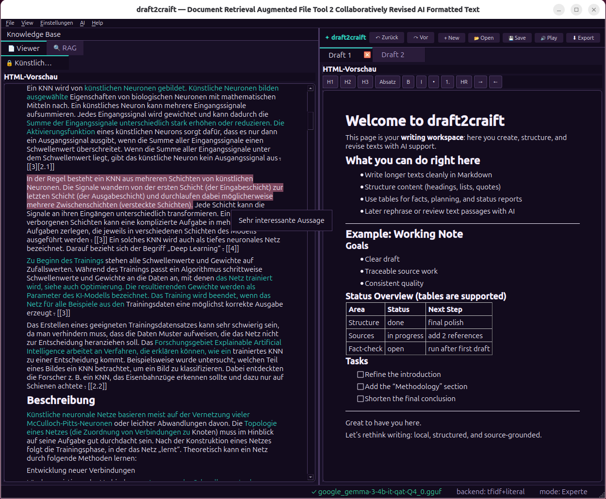

### 3) Local AI chat and model control

- GGUF inference via `llama-cpp-python`
- Live generation controls (`max_tokens`, `temperature`, `top_p`, `repeat_penalty`, `forbidden_chars`)
- Model-load controls (`n_ctx`, `n_gpu_layers`, `n_threads`)
- Configurable context sources: selected text, current draft, RAG tab, selected imported docs
- Grounded mode can intentionally refuse answers when no valid source context is active

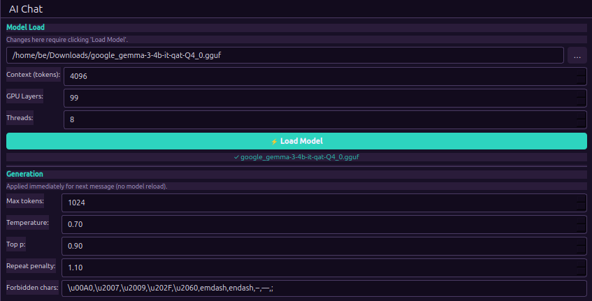


### 4) RAG engine

- Backends: TF-IDF (built-in), sentence-transformers (optional), literal search
- Chunking modes: `sliding_window`, `section`, `recursive`
- Optional HyDE, literal term expansion, and LLM reranking
- RAG debug history with per-backend details and warnings

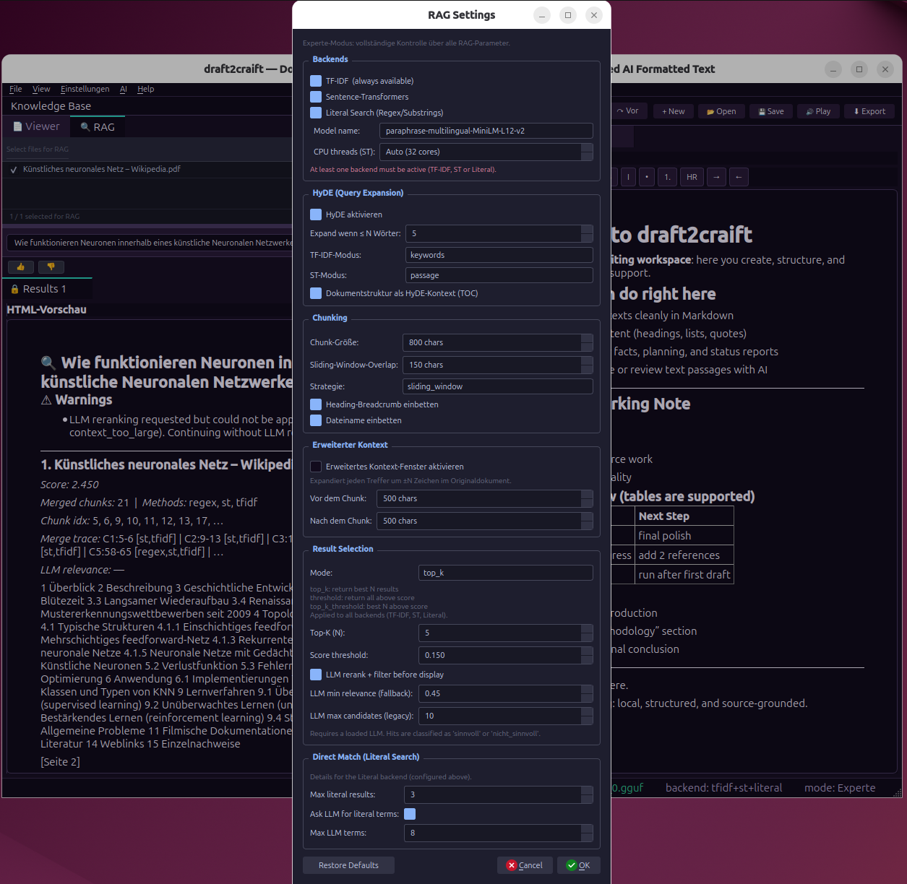
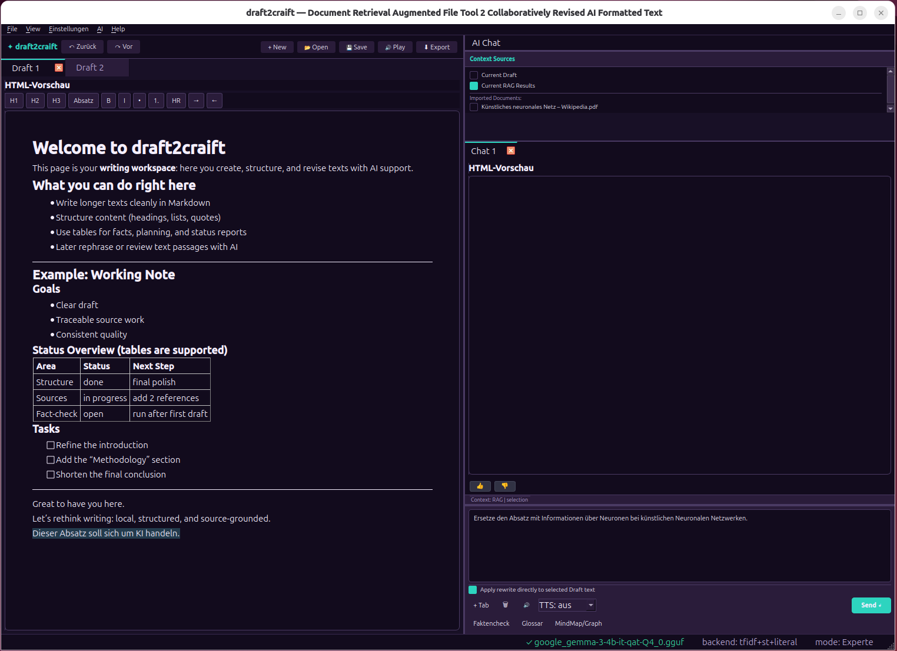
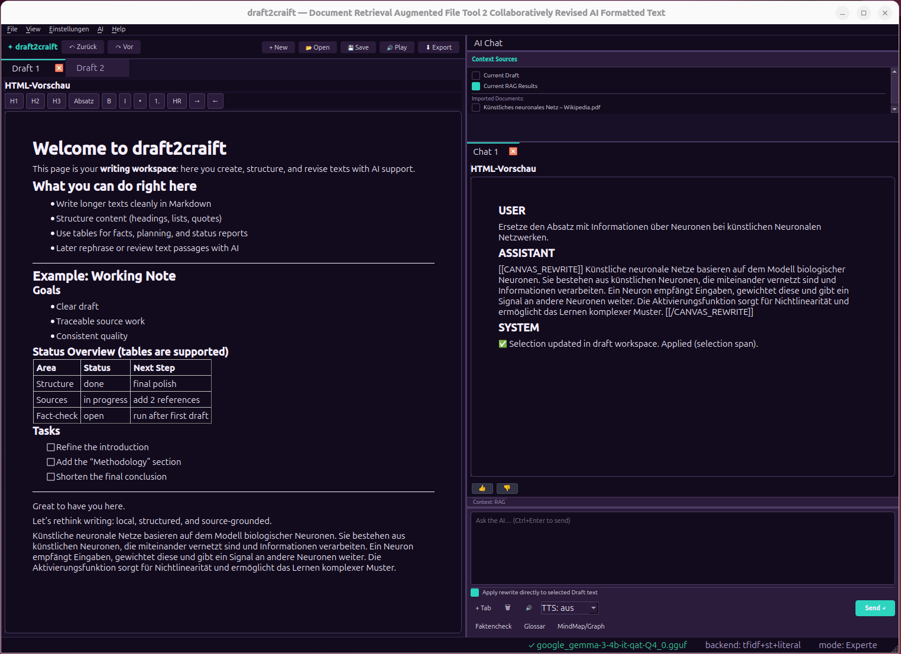

### 5) Fact-check workflow

- Claim extraction from selected/draft text
- Per-claim verification against active sources
- Output as Markdown table (`confirmed`, `partial`, `unconfirmed`, `contradiction`)

### 6) Glossary and highlights

- Glossary term management (term + definition)
- Optional preview highlights and hover info for glossary entries
- Consistent highlight store for user and glossary annotations

### 7) Voice features (optional)

- Whisper dictation (`faster-whisper` + `sounddevice`)
- Offline TTS with Piper (`piper-tts` + `onnxruntime` + `pathvalidate`)
- Local fallback TTS engine (`pyttsx3`)

### 8) Prompt and settings control

- Fully editable prompts in `prompts/defaults.json`
- Prompt groups: Chat, Fact-check, RAG, Advanced, Legacy
- Prompt flow preview and reset options
- Prompts/settings persist in project save files

### 9) Feedback and quality automation

- Built-in feedback storage (events + counters)
- **Testcase Studio:** Feedback -> triage/filter/edit -> accept/reject -> export suites
- **Eval runners:**
  - `rag_eval.py`
  - `pdf_eval.py`
  - `glossary_eval.py`
  - `mindmap_eval.py`
  - `factcheck_eval.py`
  - `judge_eval.py`
  - `llm_compare_eval.py`
- `rag_sweep.py` for parameter sweeps
- `test_studio.py` dashboard for run comparison and label analysis

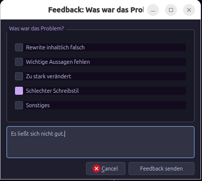
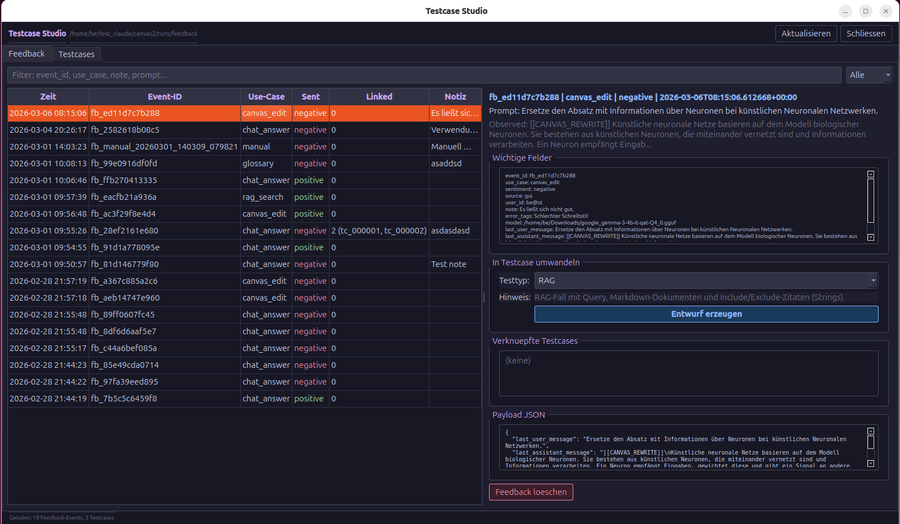
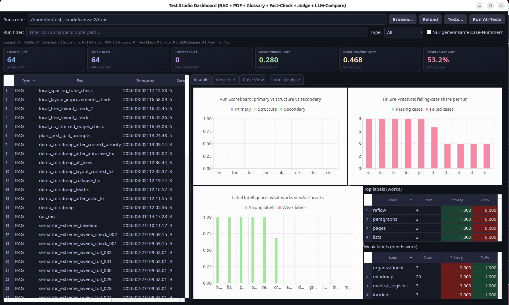
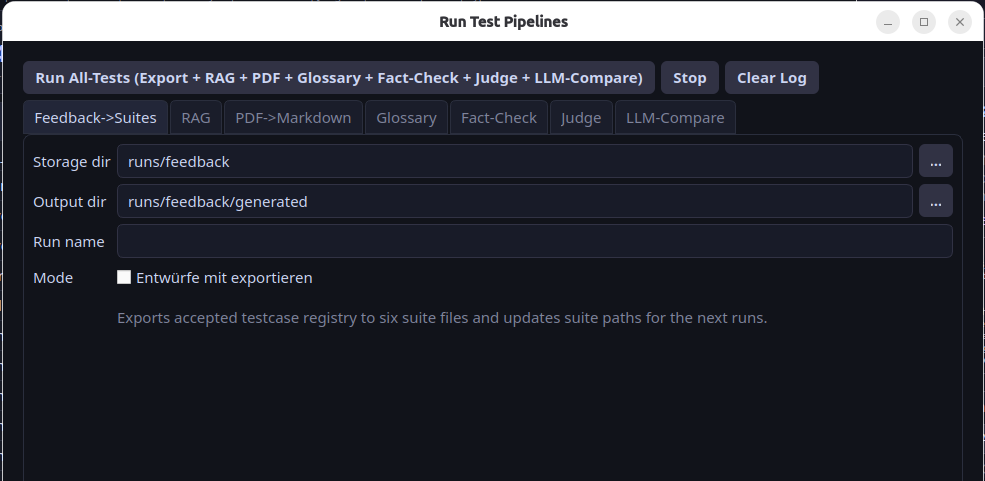

### 10) Project format

Save/load includes:

- draft tabs
- imported knowledge files
- RAG index and optional embeddings
- chat history
- logs
- prompt set
- UI state/layout
- generation/model parameters

---

## Comparison (quick)

Legend:

- ✅ built-in first-party feature
- 🟨 possible with extra setup/plugins/external backend
- ❌ no dedicated first-party workflow

Note: snapshot based on official docs as of March 2026.

| Capability | draft2craift | LM Studio | OpenWebUI | Jan.ai | Obsidian |
|---|---|---|---|---|---|
| Local GGUF inference | ✅ | ✅ | 🟨 | ✅ | 🟨 |
| Full Markdown writing workspace | ✅ | ❌ | 🟨 | 🟨 | ✅ |
| Chat with local documents (RAG) | ✅ | ✅ | ✅ | 🟨 | 🟨 |
| Deep PDF ingest control | ✅ | ❌ | 🟨 | 🟨 | 🟨 |
| Dedicated fact-check workflow | ✅ | ❌ | ❌ | ❌ | ❌ |
| Fine-grained settings (gen + RAG + import + prompts) | ✅ | 🟨 | 🟨 | 🟨 | 🟨 |
| Structured feedback triage + testcase management | ✅ | ❌ | 🟨 | 🟨 | 🟨 |
| Automatic suite generation from accepted feedback | ✅ | ❌ | ❌ | ❌ | ❌ |
| Automated evaluator stack (CLI + sweeps + dashboard) | ✅ | ❌ | 🟨 | 🟨 | 🟨 |
| Works fully local without API key (local models) | ✅ | ✅ | ✅ | ✅ | 🟨 |

**Core differentiator:** draft2craift combines **long-form Markdown drafting**,
**local chat**, **integrated RAG**, **fact-checking**, and
**feedback-to-test automation** in one local desktop flow.

---

## Installation

### Requirements

- Python 3.10+ (recommended 3.11/3.12)
- `pip`
- Windows, Linux, or macOS

### 1) Clone and install full requirements (recommended)

```bash
git clone https://github.com/annuscheit-jonas/draft2craift.git
cd draft2craift
python -m venv .venv
source .venv/bin/activate   # Windows: .venv\Scripts\activate
pip install -U pip
pip install -r requirements.txt
```

`requirements.txt` installs the full runtime stack (core + semantic RAG + NLI + speech + import backends).

### 2) Optional: switch `llama-cpp-python` build variant

`requirements.txt` installs the default wheel.
If you need a specific hardware build, reinstall one of the following:

CPU:

```bash
pip install llama-cpp-python
```

CUDA (NVIDIA):

```bash
CMAKE_ARGS="-DGGML_CUDA=on" pip install llama-cpp-python
```

Metal (Apple Silicon):

```bash
CMAKE_ARGS="-DGGML_METAL=on" pip install llama-cpp-python
```

### 3) Optional: lean profile (advanced)

If you intentionally want a reduced dependency footprint:

```bash
pip install -r requirements-core.txt
pip install -r packaging/requirements-optional-minimal.txt
```

To add AGPL/GPL import extras on top:

```bash
pip install -r packaging/requirements-optional-full.txt
```

Piper notes:

- default local model dir includes `./models/piper`
- first use can auto-download a local voice model
- disable auto-download with:

```bash
export DRAFT2CRAIFT_TTS_AUTO_DOWNLOAD=0
```

Optional custom Piper model directory:

```bash
export DRAFT2CRAIFT_PIPER_MODELS_DIR=/path/to/local/piper-models
```

### 4) Conda option

```bash
conda env create -f environment.yml
conda activate draft2craift
# environment.yml is full-feature by default
# optionally reinstall llama-cpp-python for CUDA/Metal
```

---

## Run

```bash
python main.py
```

---

## Quick Workflow

1. Import files (`Ctrl+I`)
2. Activate sources in the RAG panel
3. Load a GGUF model in Chat Dock
4. Ask/rewrite in chat with grounded context
5. Run Fact Check when needed
6. Save project (`Ctrl+Shift+S`)

---

## Privacy and Data Handling

- Inference runs locally via `llama-cpp-python` (llama.cpp).
- No cloud account is required for local model workflows.
- Your drafts, chats, and imported files stay on your machine unless you explicitly export/share them.

---

## Testing, Feedback, and QA Automation

### Main commands

```bash
# RAG evaluation
python scripts/rag_eval.py \
  --suite scripts/examples/rag_suite.example.json \
  --output-dir runs/rag_eval \
  --run-name demo_eval

# RAG parameter sweep
python scripts/rag_sweep.py \
  --suite scripts/examples/rag_suite.example.json \
  --grid scripts/examples/rag_sweep.example.json \
  --output-dir runs/rag_sweep

# Test dashboard
python scripts/test_studio.py --root runs

# Feedback -> testcase workflow UI
python scripts/testcase_studio.py --storage-dir runs/feedback

# Generate runnable suites from accepted feedback testcases
python scripts/feedback_generate_tests.py \
  --storage-dir runs/feedback \
  --output-dir runs/feedback/generated
```

### What this gives you

- reproducible run artifacts (`.summary.json`, `.cases.csv`, `.debug.jsonl`, `.log`)
- side-by-side run comparison in GUI
- structured path from user feedback to accepted regression tests

For full evaluator documentation, see [ReadmeTests.md](ReadmeTests.md).

---

## Keyboard Shortcuts (core)

| Shortcut | Action |
|---|---|
| `Ctrl+N` | New draft tab |
| `Ctrl+O` | Open file in draft |
| `Ctrl+S` | Save current tab |
| `Ctrl+I` | Import files |
| `Ctrl+Shift+S` | Save project |
| `Ctrl+Shift+O` | Load project |
| `Ctrl+Q` | Quit app |
| `Ctrl+Enter` | Send message |
| `Ctrl+.` | Stop generation |
| `Ctrl+1` | Toggle Knowledge Dock |
| `Ctrl+2` | Toggle AI Chat Dock |
| `Ctrl+3` | Toggle Debug Log |
| `Ctrl+4` | Toggle Model controls |
| `Ctrl+F` | Find/replace in active editor |
| `Ctrl+Alt+S` | Toggle autosave |

---

## Build and Distribution

Windows build scripts:

```powershell
# CPU
powershell -ExecutionPolicy Bypass -File packaging\build_windows.ps1 -Variant cpu -LicenseProfile full

# CUDA
powershell -ExecutionPolicy Bypass -File packaging\build_windows.ps1 -Variant cuda -LicenseProfile full

# both
powershell -ExecutionPolicy Bypass -File packaging\build_windows_all.ps1 -LicenseProfile full
```

Step-by-step German guide for building a portable Windows bundle and using it on a second PC:

- [docs/windows-portable-anleitung.md](docs/windows-portable-anleitung.md)
- [docs/windows-enterprise-package-anleitung.md](docs/windows-enterprise-package-anleitung.md) (enterprise install + software distribution)

Build profile hint:

- `-LicenseProfile full` for full feature build
- `-LicenseProfile minimal` for reduced dependency profile

Linux portable bundle:

```bash
bash packaging/build_linux.sh cpu full
```

---

## Troubleshooting (quick)

**Model does not load**

- verify path and GGUF file
- verify `llama-cpp-python` install variant (CPU/CUDA/Metal)
- open Debug Log (`Ctrl+3`) and check exact error

**No grounded answer**

- ensure source documents are selected
- run a RAG search first and retry

**Context/window exceeded**

- reduce active context sources
- reduce `max_tokens`
- use model with larger context window

---

## FAQ

**Which models are supported?**  
Any GGUF model supported by llama.cpp (for example Llama, Mistral, Qwen, Gemma, Phi, DeepSeek variants in GGUF form).

**Can I use draft2craift commercially?**  
Yes. The app is AGPL-3.0 licensed. Commercial use is allowed; redistribution of modified versions must follow AGPL terms.

**Is the model auto-loaded when opening a saved project?**  
No. Project load restores parameters and UI state, but model loading remains an explicit user action.

---

## License

Copyright (C) 2026 Jonas Annuscheit

Licensed under **AGPL-3.0**.
See [LICENSE](LICENSE) and [THIRD_PARTY_NOTICES.md](THIRD_PARTY_NOTICES.md).
